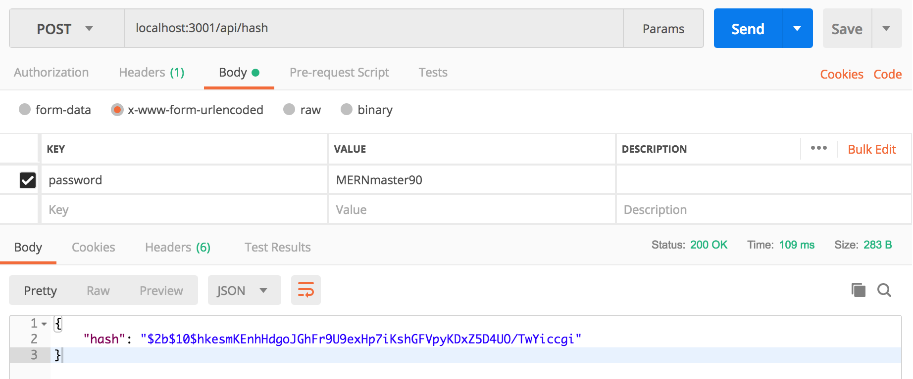
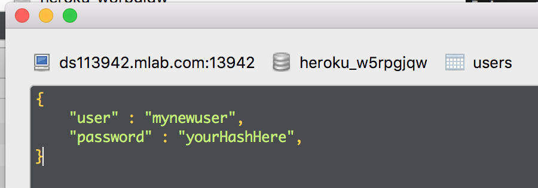
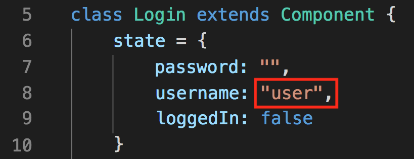
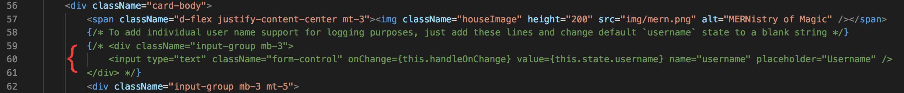

# House Points Dashboard for Coding Bootcamps

## Introduction

The house points dashboard app was developed by Hannah A. Patellis and Cj Jordan for the August 2018 Georgia Institute of Technology Web Application Development Coding Bootcamp.

We decided to split the class into Harry Potter-themed "houses" and keep points to give students an incentive to do things like...

* Show up to office hours (+1 point for each student from a house to show up on time for office hours)
* Give an exceptional answer during class
* Help other students
* Form study groups and post photos as proof (+1 point per student to show up, for example)

The idea started to snowball as we gave the houses nerdy coding pun names, house crests, and the addition of a stuffed owl awarded to the house that earned the most points in that week. If they got the owl that house would get a 24 hour extention on their homework for that week.

We found this really boosted moral in our class and we hope it does the same for your class.

You are free to use the house crest artwork and our house names. Just attribute if asked, don't try to pass it off as your own, et cetera.

## Setting it up

The application is made to run on Heroku with a mLab Mongo database.

* Create a Heroku app and provision it with an mLab Mongo database
* Clone this repo
* Create a local `.env` file with a `MONGODB_URI` value containing your mLab Mongo database URL (from Heroku)
* Run `npm install` or `yarn install`
* Run `node seedDB.js` to seed the database with initial values

## The database

#### How the database is setup

#### What seedDB.js does

## Features

#### The pages

#### Login and users

##### Hashing a password

There is no create a user feature in this application. If you want to add a user, you need to take a few steps.

1. Uncomment the hashing API route from `server.js` to make the hashing function available

2. Use an application like Postman to make a POST request to `localhost:3001/api/hash` with a `password` field set to the password you want to hash

3. Send the POST request and you'll recieve the hashed password in the body of the response in JSON format

##### Add a new user in the database

After you have hashed a password, make a new user document in your Mongo database's "users" collection.

The document should include a `user` field and a `password` field which should contain the hash you got from `localhost:3001/api/hash`.

##### Enable user support

By default the application's login page (`/login` route) does not have a username field and logs in using the default username `user`. So to make multiple accounts available, you need to make a change to the front-end code.

1. In `/client/src/pages/Login/Login.js` first change the state property `username` to a blank string. By default it is set to `user` (the default user account made with the `seedDB.js` file) so that every time the submit button is selected the authentication request is made with the username `user`.

2. In the same file, uncomment the username field div so that the user has a place to enter the username.

#### Keeping count of points and house information

#### Keeping count of points in a given timeframe (like a week)

#### Keeping track of who has the owl